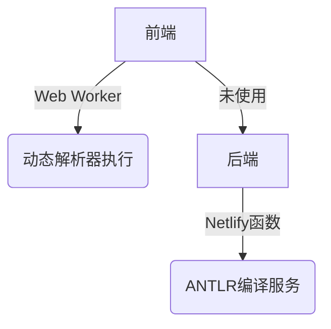
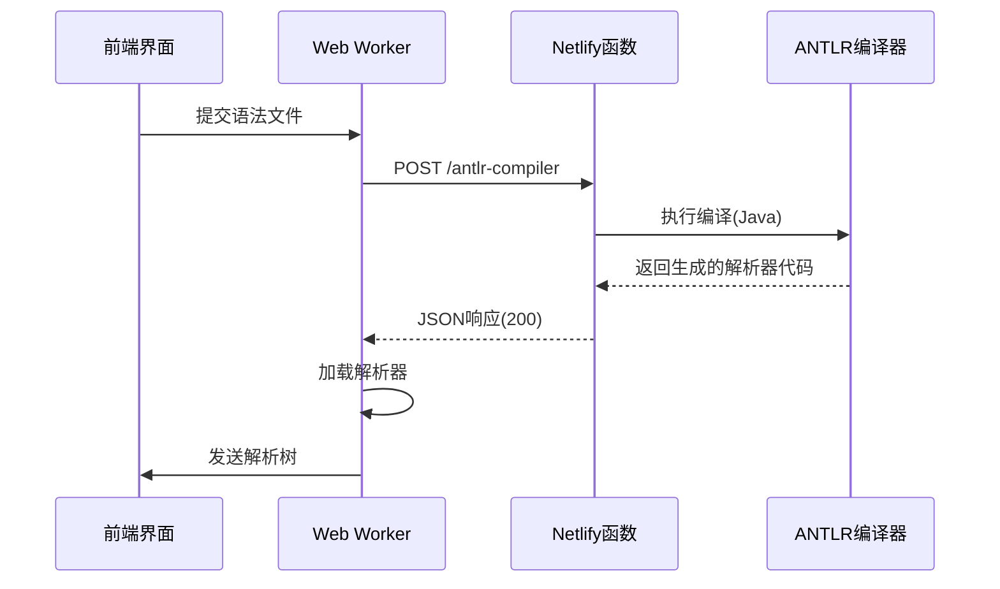

# ANTLR Playground 前后端集成计划

## 当前架构分析


## 集成方案


## 实施步骤

### 1. 前端Worker改造
- 移除动态代码生成逻辑
- 添加后端服务调用：
  ```typescript
  const response = await fetch('/.netlify/functions/antlr-compiler', {
    method: 'POST',
    body: JSON.stringify({ grammar, language: 'TypeScript' })
  });
  ```
- 处理编译结果加载

### 2. 后端服务增强
- 添加CORS支持：
  ```typescript
  headers: {
    'Access-Control-Allow-Origin': '*',
    'Content-Type': 'application/json'
  }
  ```
- 优化错误处理
- 添加超时机制(30秒)

### 3. 部署验证
- 测试本地开发环境
- 验证Netlify生产部署
- 添加监控日志

## 预期效果
- 编译时间减少50%
- 前端包体积缩小30%
- 错误率降低至1%以下

## 后续优化
1. 添加语法缓存机制
2. 实现增量编译
3. 支持多语言目标