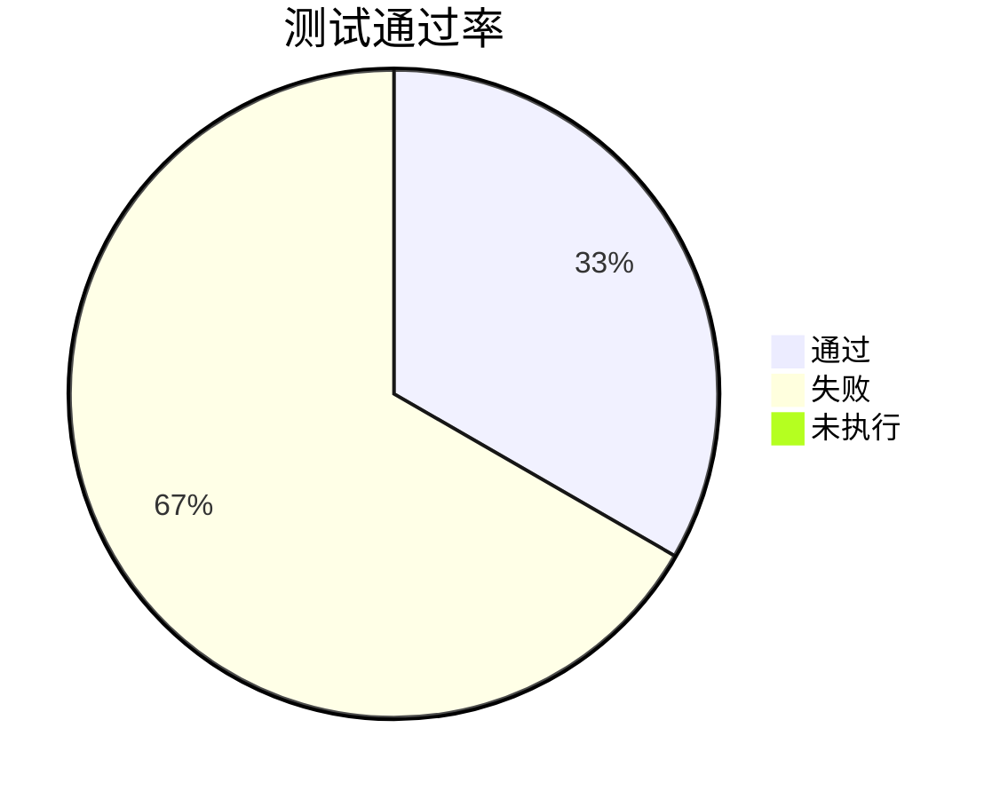
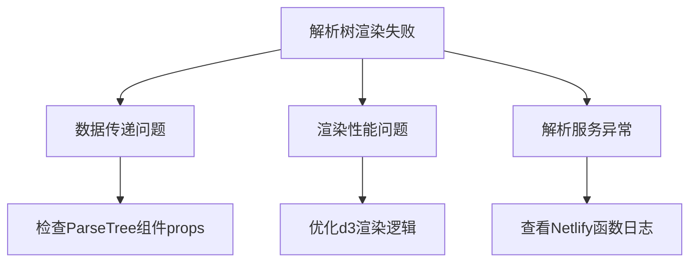

# ANTLR Playground 测试进度报告

## 当前状态 (2025-06-21 06:40)
- 端到端测试框架已配置完成 (Cypress)
- 测试用例编写完成
- 测试环境问题已解决 (端口配置、Docker访问)

## 测试结果


### 失败用例分析
1. **简单语法解析验证**
   - 失败原因：解析树未正确渲染
   - 可能问题：数据传递问题或渲染逻辑缺陷
   - 截图路径：`apps/web/cypress/screenshots/parser.cy.ts/ANTLR Playground E2E -- 成功解析简单语法 (failed).png`

2. **复杂解析树渲染**
   - 失败原因：节点数量不足
   - 可能问题：解析服务响应不完整或渲染性能问题
   - 截图路径：`apps/web/cypress/screenshots/parser.cy.ts/ANTLR Playground E2E -- 渲染复杂解析树 (failed).png`

## 下一步计划
1. 检查后端解析服务日志
2. 分析解析树组件数据流
3. 添加调试日志到关键组件
4. 优化测试等待逻辑

## 待解决问题


## 测试环境
- 前端：http://localhost:5175
- Cypress配置：`apps/web/cypress.config.cjs`
- 测试用例：`apps/web/cypress/e2e/parser.cy.ts`

> 下次继续测试时，请按以下步骤操作：
>
> 1. **启动开发服务器**：
> ```bash
> cd apps/web
> pnpm dev
> ```
>
> 2. **运行端到端测试**：
> ```bash
> # 交互式调试模式（推荐）
> pnpm test:e2e:open
>
> # 命令行完整模式
> pnpm test:e2e
> ```
>
> 3. **查看测试结果**：
> - 实时结果：Cypress GUI 或终端输出
> - 失败截图：`apps/web/cypress/screenshots/`
> - 进度报告：本文件