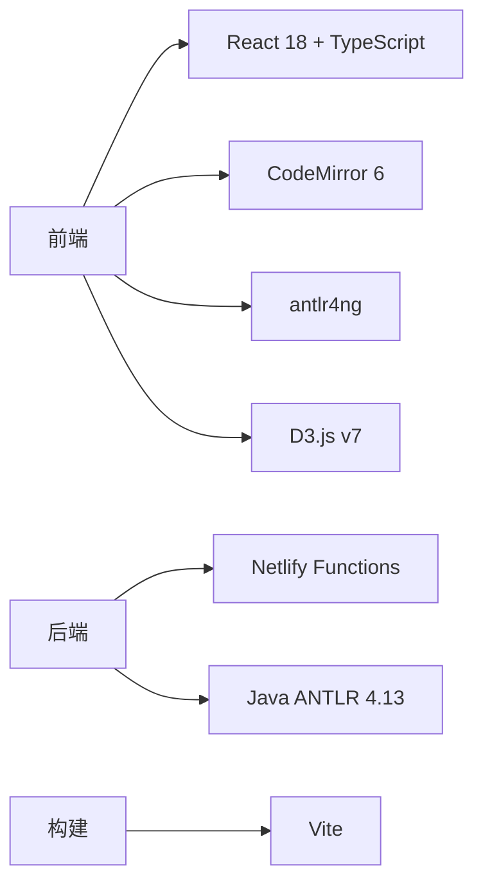

# ANTLR4 Playground 实施计划

## 项目概述
- **目标**：为教育场景构建轻量级ANTLR4语法学习平台
- **核心功能**：语法编辑、实时解析、树形可视化、错误反馈
- **目标用户**：编程语言学习者/教育工作者
- **性能标准**：支持基础语法解析（<100规则）

## 技术栈


## 文件结构
```
antlr-playground/
├── apps/
│   └── web/
│       ├── public/           # 预编译教学语法
│       │   ├── Calculator/
│       │   └── SimpleSQL/
│       ├── src/
│       │   ├── components/   # UI组件
│       │   │   ├── EditorPanel.tsx
│       │   │   ├── ParseTree.tsx
│       │   │   └── TutorialGuide.tsx
│       │   ├── workers/      # Web Workers
│       │   │   └── parser.worker.ts
│       │   ├── utils/        # 工具函数
│       │   │   ├── antlrVisitor.ts
│       │   │   └── tutorialData.ts
│       │   ├── App.tsx
│       │   └── main.tsx
│       └── vite.config.ts
└── functions/
    └── compile/              # 无服务器函数
        ├── index.js          
        └── Dockerfile        
```

## 核心功能实现
### 1. 动态解析流程
```mermaid
sequenceDiagram
    学生->>+前端: 编辑语法/输入文本
    前端->>+Web Worker: 发送解析请求
    Web Worker->>+Netlify: 请求语法编译
    Netlify-->>-Web Worker: 返回TS解析器代码
    Web Worker->>Web Worker: 动态加载解析器
    Web Worker->>Web Worker: 执行解析+转换JSON
    Web Worker-->>-前端: 返回解析树/错误
    前端-->>-学生: 显示可视化结果
    
### 3. TypeScript优势
- 强类型检查减少运行时错误
- 更好的ANTLR API支持
- 增强开发体验
```

### 2. 教学功能设计
- **预置语法**：5个教学案例（计算器/JSON/SQL等）
- **分步引导**：
  ```jsx
  // TutorialGuide.jsx
  const steps = [
    {title: "基础语法", target: "#grammar-editor", 
     content: "在此编写ANTLR语法规则..."},
    {title: "测试用例", target: "#input-editor",
     content: "输入待解析的文本示例..."}
  ]
  ```
- **错误解释**：
  ```js
  // 错误代码映射表
  const errorTips = {
    "mismatched input": "词法符号不匹配，检查拼写或规则定义",
    "no viable alternative": "语法规则无法匹配输入"
  }
  ```

## 开发里程碑
| 阶段 | 时长 | 交付物 | 风险缓解 |
|------|------|--------|----------|
| 基础搭建 | 3天 | monorepo初始化 | 使用预构建Docker镜像 |
| 核心解析 | 5天 | Web Worker通信 | 添加加载超时机制 |
| UI实现 | 4天 | 编辑器集成 | 使用react-split-pane |
| 教育优化 | 3天 | 教学案例 | 预编译核心语法 |
| 测试部署 | 2天 | Netlify上线 | 添加错误监控 |

## 部署计划
1. **Netlify配置**：
   - 函数内存：1024MB
   - 超时设置：30秒
2. **前端优化**：
   - 预编译教学语法包
   - 按需加载D3组件
3. **教育场景适配**：
   - 移动端布局优化
   - 离线示例缓存